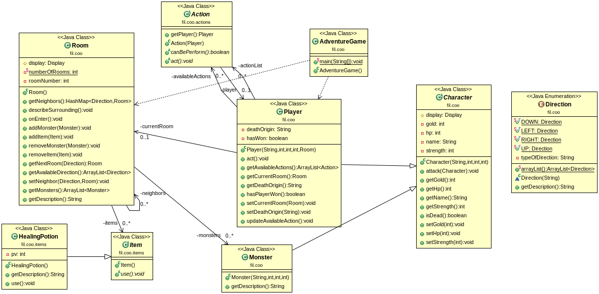

# Project Dungeon

Authors : Théophile COSSE and Florian COVEY

## The Project 
The Dungeon made of Room.
A Room can contain Items and Monsters.
The Player need to fight monsters in the Current Room before move to another Room.
Monsters will never attack the first. Item can only use once time (heal, strength and purse).

Player will win when he goes to the exit Room.

### UML Diagram


## How To
### Installation
1.Install maven, the method will depend on your distribution

For Debian/Ubuntu

```
# apt install maven
```

2.Get the project

```
$ git clone git@gitlab-etu.fil.univ-lille1.fr:cosse/covey-cosse-coo-projet-donjon.git
```

3.Make the executable

```
$ mvn package
```

### Generate Javadoc
```
$ mvn javadoc:javadoc
```

