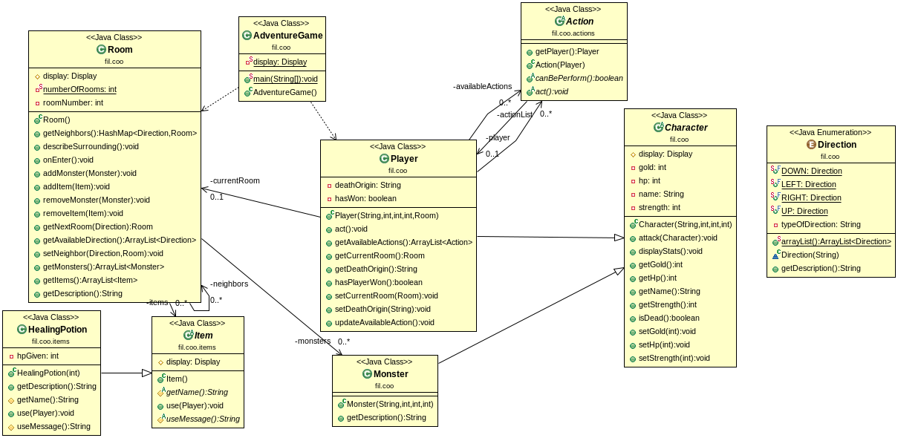

# Project Dungeon

Authors : Théophile COSSE and Florian COVEY

## The Project 
The Dungeon is made of Room.
A Room can contain Items and Monsters.
The Player need to fight monsters in the Current Room before move to another Room.
Monsters will never attack the first. Item can only use once time (heal, strength and purse).

Player will win when he goes to the exit Room.

### UML Diagram


## How To
### Installation
1. Install maven, the method will depend on your distribution

For Debian/Ubuntu

```
# apt install maven
```

2. Get the project

```
$ git clone git@gitlab-etu.fil.univ-lille1.fr:cosse/covey-cosse-coo-projet-donjon.git
```

3. Make the executable

```
$ mvn package
```
4. Execute the jar file

```
$ java -jar ./DONJON/target/*.jar
```

### Generate Javadoc
```
$ mvn javadoc:javadoc
```
The Javadoc generated can be found in /DONJON/target/docs/index.html

### Key aspect of the project

* All the displayed text are handled thanks to the Display which use the Singleton design pattern
because only one instance is ever created. This class make adding new content to display easy, anything that need to be displayed
need to implements the interface displayable.
* The different Direction the player can choose come from an enum which implements Displayable.
* The game mechanics are mainly handled by the different Action subclasses 
* Every Action need to define canPerform, this way only the Actions that can be performed are displayed


